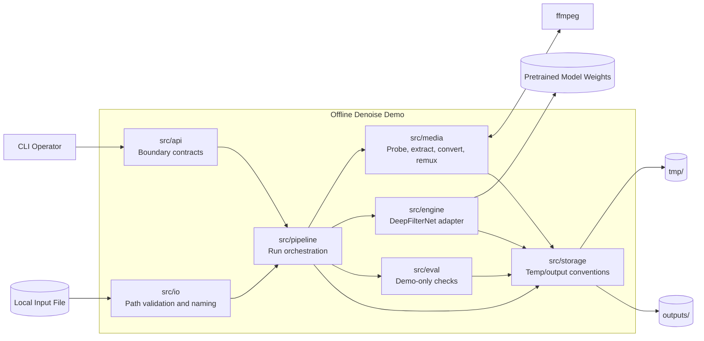
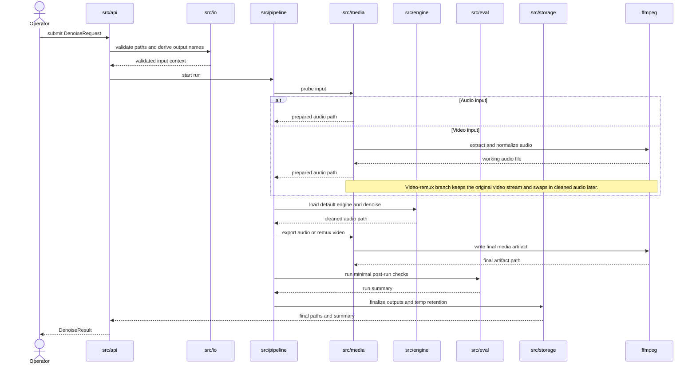

# Architecture

## High-Level Component View

## Processing Sequence

## Notes
- `src/api` is a contract boundary for the CLI flow, not a network service in MVP.
- `src/eval` is limited to lightweight demo checks such as output existence and basic sanity validation.
- `src/media` is the only module that talks directly to `ffmpeg`.
- `src/storage` is responsible for keeping `outputs/` and `tmp/` distinct.
